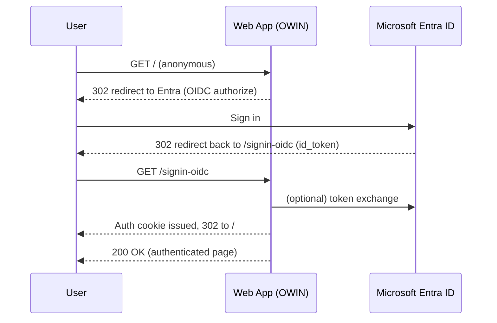

# AzureSSOTest

Two ASP.NET (.NET Framework 4.8) sample web applications demonstrating single sign-on (SSO) with **Microsoft Entra ID** (formerly Azure AD) using the **OWIN OpenID Connect** middleware. Both apps share a single Entra ID app registration so a user signed into one is recognized by the other.

| App | Type | Tech | Local URL |
|-----|------|------|-----------|
| `WebApplication1` | ASP.NET **Web Forms** | `.aspx` pages, `Site.Master`, custom `OwinPassThroughHandler` | `https://localhost:44365/` |
| `WebApplication2` | ASP.NET **MVC 5** | Controllers + Razor `.cshtml` views, `AccountController` / `HomeController` | `https://localhost:44363/` |

Both target **.NET Framework 4.8** and run on **Windows** only (IIS Express locally, Windows App Service in Azure).

---

## Repository layout

```
AzureSSOTest/
├── README.md                      ← this file
├── .gitignore
├── WebApplication1/
│   ├── WebApplication1.sln
│   └── WebApplication1/
│       ├── Web.config             ← NOT committed (contains secrets)
│       ├── Web.config.template    ← committed; copy → Web.config and fill in
│       ├── Default.aspx, About.aspx, Contact.aspx
│       ├── Site.Master
│       ├── Startup.cs             ← OWIN OpenIdConnect setup
│       └── OwinPassThroughHandler.cs
└── WebApplication2/
    ├── WebApplication2.sln
    └── WebApplication2/
        ├── Web.config             ← committed with placeholders (no secret)
        ├── Web.config.template
        ├── Controllers/
        │   ├── HomeController.cs
        │   └── AccountController.cs
        ├── Views/                 ← Razor .cshtml
        └── Startup.cs             ← OWIN OpenIdConnect setup
```

> `bin/`, `obj/`, `packages/`, `.vs/`, `*.user`, and the real `WebApplication1/WebApplication1/Web.config` are excluded via `.gitignore`. NuGet packages are restored automatically on first build.

---

## How authentication works



- `Startup.cs` in each app wires up `UseCookieAuthentication` + `UseOpenIdConnectAuthentication`.
- `Web.config` `<authorization><deny users="?"/></authorization>` forces every page to require a signed-in user; anonymous requests trigger the OIDC redirect.
- The `/signin-oidc` endpoint (and static `Content`/`Scripts`/`favicon.ico`) is whitelisted via `<location path="...">` so the callback and assets work anonymously.
- Because both apps register the **same Entra app registration**, a user signed into one is already authenticated to Entra and gets a silent, non-interactive sign-in when visiting the second app.

---

## Prerequisites

- **Visual Studio 2022** (Community or higher) with the *ASP.NET and web development* workload.
- **.NET Framework 4.8** Developer Pack / targeting pack (included with VS installer).
- A **Microsoft Entra ID** tenant (an Azure/Microsoft 365 tenant works).
- Optional for Azure hosting: an **Azure subscription**.

---

## Entra ID (Azure AD) app registration setup

You need **one** app registration shared by both apps.

1. Sign in to the [Azure Portal](https://portal.azure.com) → **Microsoft Entra ID → App registrations → New registration**.
2. **Name**: `AzureSSOTest-WebApps`
3. **Supported account types**: choose what fits (single-tenant is fine for a demo).
4. **Redirect URI** → platform **Web**, add these URIs:
   - `https://localhost:44365/signin-oidc`  (WebApplication1, local)
   - `https://localhost:44363/signin-oidc`  (WebApplication2, local)
   - `https://<your-app1-name>.azurewebsites.net/signin-oidc`  (after Azure deploy)
   - `https://<your-app2-name>.azurewebsites.net/signin-oidc`  (after Azure deploy)
5. **Register**, then note the **Application (client) ID** on the Overview page.
6. **Certificates & secrets → New client secret** → copy the **Value** immediately (it's hidden later).
7. **Authentication** → enable **ID tokens** (checked) → **Save**.
8. (Optional) **Token configuration → Add optional claim → ID** → add `email`, `preferred_username` if you want them in the claims.

You now have:
- **ClientId** = the application (client) ID
- **ClientSecret** = the secret value
- **Authority** = `https://login.microsoftonline.com/common/v2.0` (or your specific tenant ID: `https://login.microsoftonline.com/<tenant-id>/v2.0`)

---

## Local development setup

### 1. Clone & restore

```bash
git clone https://github.com/<your-username>/AzureSSOTest.git
cd AzureSSOTest
```

Open each `.sln` in Visual Studio; NuGet packages restore automatically.

### 2. Create `Web.config` from the template

**WebApplication1** (the real `Web.config` is git-ignored because it holds a secret):

```bash
copy WebApplication1\WebApplication1\Web.config.template WebApplication1\WebApplication1\Web.config
```

Edit the new `WebApplication1\WebApplication1\Web.config` and fill in:

```xml
<appSettings>
  <add key="ida:ClientId" value="YOUR-CLIENT-ID" />
  <add key="ida:ClientSecret" value="YOUR-CLIENT-SECRET" />
  <add key="ida:Authority" value="https://login.microsoftonline.com/common/v2.0" />
  <add key="ida:RedirectUri" value="https://localhost:44365/signin-oidc" />
  <add key="ida:PostLogoutRedirectUri" value="https://localhost:44365/" />
</appSettings>
```

**WebApplication2** ships a `Web.config` with placeholders — edit it directly:

```xml
<add key="ida:ClientId" value="YOUR-CLIENT-ID" />
<add key="ida:ClientSecret" value="YOUR-CLIENT-SECRET" />
<add key="ida:RedirectUri" value="https://localhost:44363/signin-oidc" />
<add key="ida:PostLogoutRedirectUri" value="https://localhost:44363/" />
```

> Use the **same ClientId and ClientSecret** for both apps (same Entra registration). Only the redirect URI differs (port 44365 vs 44363).

### 3. Configure IIS Express SSL ports

Each `.csproj` pins its IIS Express URL (`44365` for app1, `44363` for app2). If your local ports differ, either update the `.csproj` `<IISUrl>` or update the `ida:RedirectUri` values **and** the matching redirect URIs in the Entra app registration to match.

### 4. Run

In Visual Studio, set the project as startup and press **F5** (or **Ctrl+F5** without debugging). Your browser opens, you're redirected to Microsoft to sign in, then returned authenticated.

---

## Hosting on Azure (Windows App Service)

These apps are **.NET Framework 4.8**, so they require a **Windows** App Service Plan. They will **not** run on Linux App Service or Azure Static Web Apps.

### Free tier note

The **Free F1** tier is genuinely $0/month and can host **both apps on a single plan**. Limits: 60 minutes CPU/day (shared), 1 GB RAM, 1 GB storage, no custom domains, no Always On (apps sleep after ~20 min idle), no SLA. Fine for demos; upgrade to **Basic B1** (~$13–55/mo Windows) for production.

### Step-by-step

1. **Portal → Resource groups → Create** → name `rg-azure-ssotest`, pick a region.
2. **App Service Plans → Create**:
   - Resource group: `rg-azure-ssotest`
   - Name: `plan-f1-win`
   - OS: **Windows**
   - Pricing tier: **Free F1**
3. **App Services → Create → Web App** (repeat for both):
   - Publish: **Code**
   - Runtime stack: **.NET Framework 4.8**
   - OS: **Windows**
   - App Service Plan: `plan-f1-win`
   - Names: `azure-ssotest-app1` and `azure-ssotest-app2`
4. **Update each app's `Web.config` redirect URIs** to the Azure URLs:
   ```xml
   <add key="ida:RedirectUri" value="https://azure-ssotest-app1.azurewebsites.net/signin-oidc" />
   <add key="ida:PostLogoutRedirectUri" value="https://azure-ssotest-app1.azurewebsites.net/" />
   ```
   (Use `Web.Release.config` XDT transforms so local dev keeps `localhost`.)
5. **Entra ID app registration → Authentication** → add the two `*.azurewebsites.net/signin-oidc` redirect URIs → Save.
6. **Publish from Visual Studio**: right-click project → **Publish → Azure → Azure App Service (Windows)** → select the target App Service → **Publish**.
7. **Verify**: open the Azure URL in a private window; you should be redirected to Microsoft sign-in and back authenticated.

### Optional hardening

- Move `ida:ClientSecret` out of `Web.config` into **App Service → Configuration → Application settings** (App Service injects these into `appSettings` automatically; they override file values at runtime and are encrypted at rest).
- Enable **HTTPS Only** on each App Service (free).
- **Rotate the client secret** in Entra ID if it was ever committed to git or shared.

---

## Troubleshooting

| Symptom | Likely cause | Fix |
|---|---|---|
| `AADSTS50011: redirect_uri mismatch` | Entra registration doesn't have the URI you're hitting | Add the exact URL (including `https://`, port, `/signin-oidc`) to the app registration |
| Login redirect loop / 401 loop | `Web.config` redirect URI doesn't match the actual site URL, or `/signin-oidc` isn't whitelisted | Verify `<location path="signin-oidc">` allows `*`, and the `ida:RedirectUri` value equals the deployed URL + `/signin-oidc` |
| `IDX20803: Unable to obtain configuration` | Network/authority issue or wrong `ida:Authority` | Use `https://login.microsoftonline.com/<tenant-id>/v2.0` or `/common/v2.0` |
| 502.5 / 500 on Azure | App Service runtime mismatch | Confirm Runtime stack = **.NET Framework 4.8** (not .NET 8) |
| Slow first hit / app "asleep" on Azure | Free F1 unloads idle apps (no Always On) | Normal on F1; warm by hitting the URL, or upgrade to Basic B1 |
| `Could not load file or assembly Microsoft.Owin...` | NuGet packages not restored | Build in VS (auto-restores) or run `nuget restore` |
| Secret shows in repo search | Real `Web.config` was committed | It's git-ignored; if it leaked, **rotate the secret in Entra ID** and clean history |

---

## Security notes

- **Never commit `Web.config` containing a real client secret.** `WebApplication1`'s `Web.config` is in `.gitignore`; a `Web.config.template` is committed instead. Before sharing the repo publicly, search it for any fragment of your secret and rotate in Entra ID if found.
- The `ida:ClientSecret` is a credential. Anyone with it can authenticate as your app to Entra ID. Treat it like a password.
- For production, prefer **App Service Application settings** (or Azure Key Vault) over plaintext `Web.config`.

---

## Tech stack

- ASP.NET Web Forms (app1) / ASP.NET MVC 5 (app2)
- .NET Framework 4.8
- OWIN (`Microsoft.Owin.Host.SystemWeb`, `Microsoft.Owin.Security.OpenIdConnect`, `Microsoft.Owin.Security.Cookies`)
- Microsoft.IdentityModel.Protocols.OpenIdConnect 6.x
- Microsoft Entra ID (Azure AD) as the identity provider
- IIS Express (local) / Azure App Service Windows (cloud)

---

## License

This sample is provided as-is for learning purposes. No license is granted for production use without your own review.